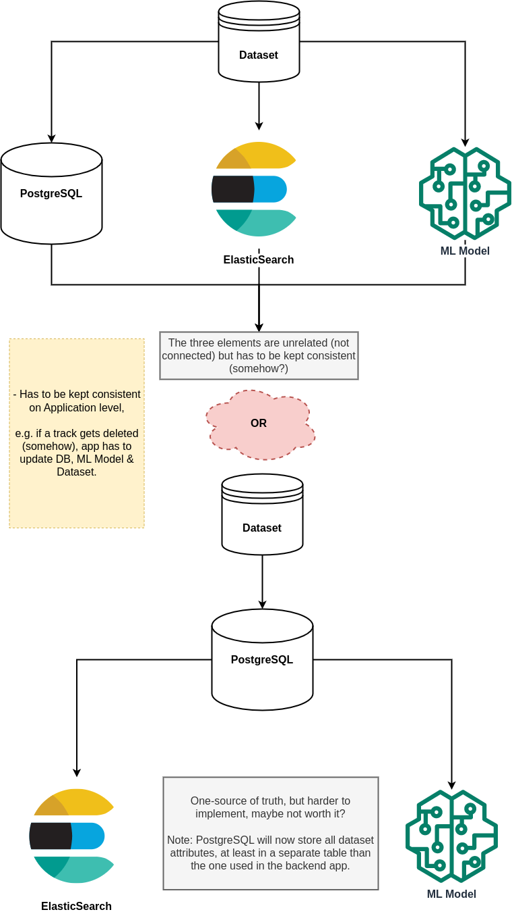

# SRC: https://youtu.be/j61yfEfeJAE

- Goes without saying that this is for headache-free local development only.
- 1000x easier to use a cloud instance of Elasticsearch.

1. You might have to run: `sysctl -w vm.max_map_count=262144`, to show `cat /proc/sys/vm/max_map_count`
2. `docker network create elastic`
3. `docker run --name es-node01 --net elastic -p 9200:9200 -p 9300:9300 -t docker.elastic.co/elasticsearch/elasticsearch:8.7.0`
4. `docker cp es-node01:/usr/share/elasticsearch/config/certs/http_ca.crt .`
5. verify it works. => `curl --cacert http_ca.crt -u elastic https://localhost:9200` & paste your password
6. To reset enrollment token (if needed): docker exec (google it) & `./bin/elasticsearch-create-enrollment-token -s kibana`
7. To reset password `./bin/elasticsearch-reset-password -u elastic`
8. `docker run --name kibana-01 --net elastic -p 5601:5601 docker.elastic.co/kibana/kibana:8.7.0`
9. Go to the url and provide enrollment token then username & password.
10. `docker cp elasticsearch.yml es-node01:/usr/share/elasticsearch/config/elasticsearch.yml` to apply `verification_mode: none` then restart container.
11. `docker cp kibana.yml kibana-01:/usr/share/kibana/config/kibana.yml` to apply `verification_mode: none` then restart container. // to-do re-order correctly
12. You've got Elasticsearch & Kibana working.

---

# For metricbeat

- Thankfully `docker compose` works here without much hassle.

1. `chmod go-w metricbeat.yml` to make it re-writeable again `chmod a+w metricbeat.yml`
2. `chown 0 metricbeat.yml` (maybe needed)

---

